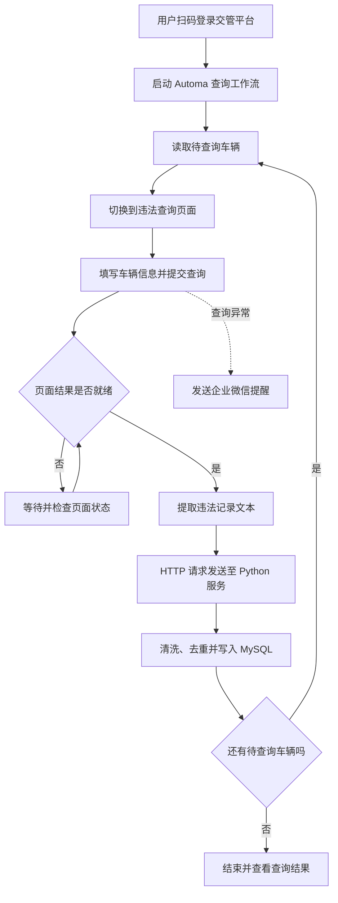

# 自动化违章查询系统

面向汽车租赁企业的交通违法信息处理系统，围绕车辆、租赁合同、承租驾驶员与交通违法记录建立业务关联。项目通过 Chrome 自动化工作流查询车辆违法信息，由 Python 服务端完成数据清洗和入库，并配合管理前端提供业务查看与数据导出能力，减少重复查询和手工登记。

> 本仓库当前代码主要覆盖 Python 服务端数据接收与处理。浏览器自动化流程和阿里云魔笔管理前端属于配套部分，完整前端工程不在当前代码目录中。

## 系统组成

### Chrome 网页机器人：Automa

网页机器人使用 Chrome 插件 [Automa](https://www.goautoma.com/extension/docs/)。Automa 是用于浏览器自动化的低代码/无代码扩展，可通过可视化工作流组合触发器、网页交互、循环、条件判断、文本提取和 HTTP 请求等模块。

配套工作流 JSON 使用 Automa 1.29.5 格式。根据流程配置，其主要逻辑为：在用户授权并登录交管平台后，切换到查询页面，按车辆执行页面操作与数据读取，再将结果发送到后端接口；流程还包含等待、循环、元素状态检查和异常提醒等步骤。使用自动化工作流时，应遵守交管平台规则并确保账号和车辆数据已获得授权。



查询过程演示：[B 站视频：车辆违章查询流程](https://www.bilibili.com/video/BV12pvAzoE6X/)

### 管理前端：阿里云魔笔

管理前端基于阿里云魔笔服务搭建，用于呈现车辆与违法信息、查看相关业务状态并进行数据检索和导出。配套项目介绍还涉及企业任务状态、车辆信息维护，以及租赁合同导入、承租人绑定和退车解绑等业务操作。

管理前端及数据导出演示：[B 站视频：魔笔管理页面](https://www.bilibili.com/video/BV1DLvAzaEL8/)

### Python 服务端

服务端以 Flask 提供 HTTP 接收接口。它读取自动化流程发送的结构化数据，计算记录标识、补充违法分值和罚款金额，并将数据批量插入或更新到 MySQL。对于未收录的违法类型，代码可通过企业微信群机器人配置发送提醒。

## 主要能力

- **车辆违法信息查询**：Automa 工作流在用户授权登录后，按车辆执行查询并提取页面数据。
- **数据清洗与标准化**：统一整理车牌、违法时间、地点、违法内容、处理状态和缴款状态等字段。
- **重复记录识别与同步**：根据违法记录标识判断新增或变更，批量写入或更新 MySQL。
- **租赁业务关联**：配套业务流程支持导入租赁合同信息，并根据车辆及租期匹配承租驾驶员；使用说明包含批量绑定、退车解绑及长租合同按月拆分流程。
- **运营查看与导出**：通过魔笔管理前端查看业务数据、跟踪相关状态并导出记录。
- **异常提醒**：可配置企业微信群机器人，对新违法类型或查询异常发送提醒。

## 技术栈

| 部分 | 技术 |
| --- | --- |
| 网页自动化 | Chrome、Automa 工作流 |
| 服务端 | Python、Flask、Waitress |
| 数据库 | MySQL、PyMySQL、SQLAlchemy（数据模型定义） |
| HTTP 与通知 | Requests、Requests Toolbelt、企业微信群机器人 Webhook |
| 管理前端 | 阿里云魔笔 |

## 仓库结构

| 文件 | 说明 |
| --- | --- |
| `app.py` | Flask 接收接口；处理违法数据并同步到 MySQL |
| `data_clean.py` | 清洗采集结果、生成违法记录标识并计算分值和罚款 |
| `violation_contents.py` | 已知违法类型清单，用于识别新类型 |
| `sql_object_structure.py` | 违法记录表的数据模型定义 |
| `wxwork_func.py` | 企业微信群机器人消息及文件发送辅助函数 |
| `requirement.txt` | Python 依赖版本 |

## 运行说明

### 环境要求

- Python 3.9 或兼容版本
- MySQL 数据库
- 可向服务端发送查询数据的客户端（如配套自动化工作流）
- （可选）企业微信群机器人 Webhook

### 安装依赖

```bash
pip install -r requirement.txt
```

### 配置服务

部署前需配置 `app.py` 中的 MySQL 连接信息和企业微信群机器人 Webhook。当前代码中的数据库连接字段和 `webhook_qywx` 为空，需在部署环境中按实际情况配置。生产凭据应通过环境变量或部署平台的密钥管理功能注入，不要写入公开仓库。

### 启动

```bash
python app.py
```

服务默认监听 `0.0.0.0:9000`，根路径 `POST /` 接收 JSON。请求数据包含 `company` 和 `data` 字段；`data` 为二维数组，首行为表头，其后每行按以下顺序提供字段：

```text
车牌号、违法时间、违法地点、违法内容、处理状态、处理时间、缴款状态
```

服务端逻辑使用 `violation_data` 和 `company_status` 表；写入后还会通过 `rent_period` 表按车牌和租期匹配驾驶员及合同信息。部署前请结合实际数据库结构准备相关表与字段。

## 使用边界

本系统面向获得授权的企业账号和车辆业务数据。使用者应遵守交管平台规则及相关法律法规，并妥善保护驾驶员个人信息、车辆信息和账号凭据。
